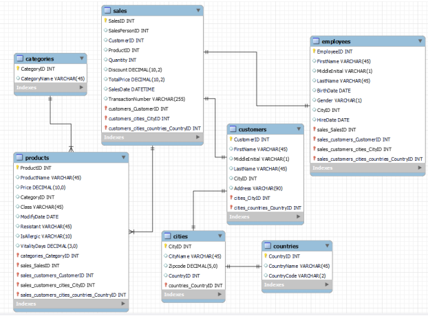

<h1>Green Mall (2017-2018) Grocery Sales Analysis</h1>

<h2>Project Background</h2>

Green Mall, established in 1980, rapidly expanded to become a leading multinational retail company with over 4,000 grocery supermarkets worldwide. In less than three decades, it has demonstrated significant growth by establishing a strong presence in several countries.

The aim of this project is to leverage data analytics to understand sales trends and consumer behaviors during 2017 and 2018. By analyzing this data, Green Mall intends to enhance business decision-making and tailor its strategies based on the uncovered trends and patterns. 

<h2>Dataset Overview</h2>

The dataset comprises sales records from 2017 and 2018, sourced from various Green Mall supermarket locations around the globe. Each record includes details such as product name, product category, sales quantity, sales amount, date of sale, and location of the supermarket. The dataset encompasses over 2 million entries, offering a robust base for comprehensive analysis.

<h2>Executive Summary</h2>

<h2>Analysis & Insights</h2>

<h2>Recommendations</h2>

<h2>Assumptions & Caveats</h2>
