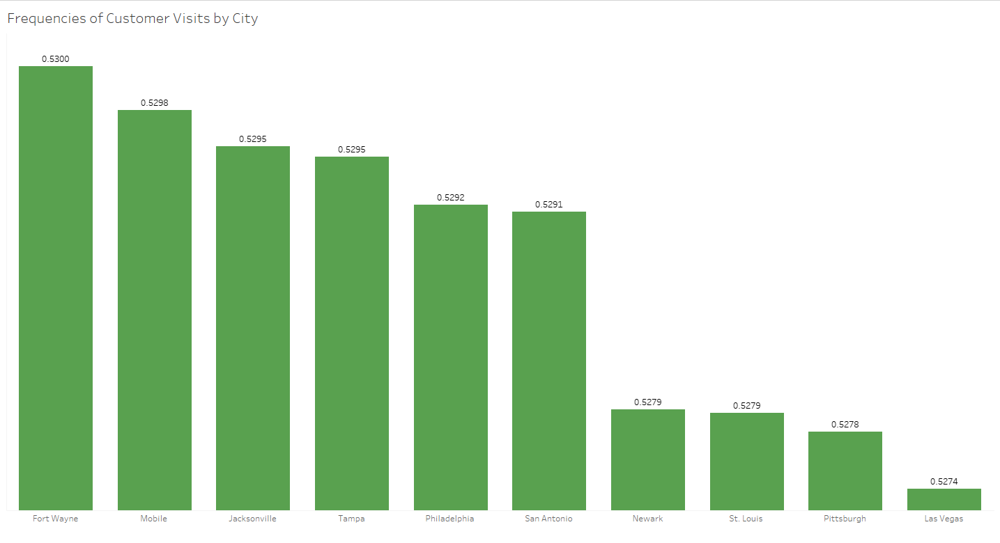

# Green Mall Grocery Sales Analysis 
**From January 1st to May 8th, 2018**

## Project Background

Green Mall, founded in 1980, has grown exponentially to become a premier multinational retail corporation with a network of over 1,000 grocery supermarkets globally. Achieving substantial expansion in under three decades, the company has cemented a significant presence in numerous countries, showcasing its capability to adapt and thrive in diverse market environments.

The goal of this project is to utilize data analytics to analyze sales data from January through early May 2018 across the United States. By identifying key performance indicators during this period, we aim to determine the most effective business strategies moving forward.

During the analysis phase, the following metrics or key performance indicators will be calculated:

1. **Main KPIs**:
    - **Total Sales**: Aggregate the sales data across all stores to calculate the total sales revenue during the specified months.
    - **Total Customers**: Count the total number of unique customer transactions to measure number of customers during the specified months.
    - **Total Amount of Products Sold**: Count the total number of products from every transactions to measure the total quantity of all the products that were sold during the specified months. 
2. **The Month with Highest Sales Fluctuations**:
    - Calculate the average sales and count the number of days that perform higher than the average and days that perform lower. Then, calculate the ratios of these numbers for each month. The resulting numerical values helps us identify sales disparity of each month.
3. **The City with Stable Sales Across Different Products**:
    - Calculate the standard deviation of sales across different products for each city. Cities with the lowest standard deviation are considered to have the most stable sales across products. This metric highlights markets with consistent product demand.
4. **The City with Highest Frequency of Customer Visits**:
    - Determine the average number of visits per customer by city. This involves counting the total visits and dividing by the number of unique customers in each city. The city with the highest average is identified as having the most frequent customer visits, indicating high customer engagement.

**Analysis Strategy**

First, we access the sales data from the designated period for the United States region by querying the Green Mall's SQL database. Next, we check the integrity and structure of the dataset to determine whether it's ready for analysis or requires additional processing. We then use Python to conduct a detailed examination of the data, adding necessary metrics to enhance our analysis. Finally, we utilize Tableau to create an interactive dashboard that delivers extensive visualizations of the data.

SQL queries for fetching sales data from the database can be found [here](https://github.com/Thihamz9/grocery_sales_analysis/blob/4bb18382c5b0a2e4c4202164851e1fbc04b9fa8e/join_sales.sql).

Python notebook for processing the data can be found [here](data_preparation_notebook.ipynb).

Interactive Tableau dashboard from the analysis can be found [here](https://public.tableau.com/shared/PXQCF4YHQ?:display_count=n&:origin=viz_share_link).

## Dataset Overview

The dataset is synthesized by selecting 21 fields and all the 2018 sales related records in the United States region from the Green Mall's database.
The fields are selected in accordance with the objectives as follows:

<strong>sales_id, customer_id</strong>: For counting the number of sales, and customers.

<strong>quantity, total_price</strong>: For evaluation of total sales, customer spending habits, and calculation of other essential metrics

<strong>sales_date</strong>: For identifying sales trends and performing other time series analysis tasks as well as defining the scope of the project.

<strong>product_name, price, category_name</strong>: For evaluation of product sales 

<strong>customer_first_name, customer_last_name</strong>: For identifying customer spending and buying frequency

<strong>city_name</strong>: For identifying sales trends by cities

    Notice: The database does not have data for total amount of each sale after the discount, which is extremely useful for analysis. Thus, a new column, total_price, calculated from quantity times sales minus discount, is added to the dataset using python before the analysis phase.

## Executive Summary

![[green_mall_executive_summary.png]](green_mall_executive_summary.png)

Over the course of the specified period, Green Mall's supermarket operations across the United States achieved substantial sales figures, totaling **$4.26 billion**. The **peak sales day** occurred on **February 24**, marking the highest single-day sales, while the **lowest sales** were recorded on **April 25**. This period also saw significant **customer engagement**, with a total of **6.64 million customer walk-ins** and **86.32 million products sold** across all stores.

Furthermore, detailed analysis identified that **February exhibited the highest fluctuations** in daily sales, suggesting variability that could be tied to specific marketing campaigns or seasonal buying patterns. Further investigation may be needed to refine strategies effectively.

Among various cities, **Long Beach demonstrated the most stable sales distribution across different products**, indicating a balanced market demand. It also ranked 30th in terms of customer visit frequency. However, it appeared second only to Omaha, in terms of sales, showing that customers in Long Beach likely to spend less than other cities on each visit. Implementing sales strategies that incentivize increased spending, such as enhanced customer rewards for higher purchases, could potentially boost revenue.

**Fort Wayne emerged as the city with highest frequency of customer visits**, averaging a visit nearly every two days per customer, highlighting it as a key area for potential marketing and sales focus. Fort Wayne also ranked as the fourth city with highest sales, totaling up to $46.87 million. However, it ranked 53rd in terms of sales variation across different products indicating that certain products have higher sales than others. Promotional strategies like providing discounts to undersold products may encourage a balanced market and increase sales further. 

## Analysis & Insights

### Finding the Month with Highest Sales Volatility

To quantify the month with the highest sales volatility, we define the ratio using the following mathematical notation:

$$ \text{Volatility Ratio} = \frac{\text{Number of Days Below Average}}{\text{Number of Days Above Average}} $$

This ratio measures the disparity in sales distribution within each month, where a higher value indicates a greater prevalence of days with sales falling below the average compared to those above, thereby signifying higher sales volatility.

The following visualization showcased each day's sales as circles on the plot, with their vertical position indicating the sales volume and their color indicating the month. Notably, a red circle represented the highest sales day, and a green circle represented the lowest, corresponding to February and April, respectively. 

![[total_sales_bubbles.png]](total_sales_bubbles.png)

To apply the Volatility Ratio defined earlier, we first calculated the daily average sales for each month. Then, we counted the number of days each month with sales above and below the monthly average respectively. 
#### January

The average sales for January were $33.25 million. During this month, there were 18 days with sales falling below this average and 13 days above it. This resulted in a ratio of 1.4, showing that for approximately every day of above-average sales, there were 1.4 days of below-average sales.
![[January_sales_bubbles.png]](January_sales_bubbles.png)
#### February

The month showed a small contrast with 16 days below the average and 12 days above, resulting in a ratio of 1.3. To translate, for approximately every day of above-average sales, there were 1.3 days of below-average sales.

![[february_sales_bubbles.png]](february_sales_bubbles.png)

#### March

March demonstrated greater stability with 16 days below the average and 15 days above, translating to a ratio of 1.1. This suggests that for every day of sales above average, there are about 1.1 days of sales below average, marking March as the most stable month in terms of sales fluctuations.

![[march_sales_bubbles.png]](march_sales_bubbles.png)
    
#### April

There were 18 days with sales below the average and 12 above, leading to a ratio of 1.5. This suggests that for every day of sales above average, there are about 1.5 days of sales below average, marking March as the highest month in terms of sales fluctuations.

![[april_sales_bubbles.png]](april_sales_bubbles.png)
#### May

The data available for May was limited, making it challenging to calculate the ratio for the entire month. However, based on the data we had for the first eight days, May showed a balanced profile, with an equal number of days above and below the average—four each. This resulted in a ratio of 1.0, indicating a perfectly balanced sales performance for the period covered.

![[may_sales_bubbles.png]](may_sales_bubbles.png)

Based on the analysis, **April emerges as the month with highest sales volatility**.

### Finding the City with Most Even Distribution of Sales

To determine which city exhibits the most even distribution of sales across different products, we employed a systematic approach that leverages standard deviation as a key metric. Standard deviation provides a quantifiable measure of dispersion or variability around the mean, making it an ideal metric to assess sales distribution.

A smaller standard deviation indicates that the sales figures for most products are close to the city's average, suggesting a more uniform distribution of consumer demand across products.

To better visualize the differences in sales distribution among cities, we created a bar plot representing the standard deviations for each city, arranged from smallest to biggest. 

![[sales_variation.png]](sales_variation.png)

The visualization revealed that **Long Beach** has the **smallest standard deviation** among all the cities examined. This indicates that Long Beach enjoys a relatively even distribution of sales across its different products, suggesting that no single product dominates the market to a significant extent.

   
### Finding the City with Highest Customer Visit Frequency

To determine which city exhibits the highest customer visit frequency, we first calculated the total number of times a customer visited within the specified period. The results display how many times a customer likely to visit for every day. Then, we calculated an average of these calculations for each city, and the result helps us quantify how likely a customer from a city visit for every day. 

$$ \text{Visit Frequency of Customer A} = \frac{\text{Total Number of Days Customer A visited within the specified period}}{\text{Total Number of Days in the specified period}} $$

$$ \text{Average Visit Frequency} = \frac{\text{Total Visit Frequency of All the Customers}}{\text{Total Number of Customers}} $$

We visualized the results in a plot that ranks cities by their average customer visit frequency.

![[visit_frequency.png]](visit_frequency.png)

The visualization revealed that **Fort Wayne** has the highest average customer visit frequency at **0.5300**, indicating that on average, a customer in Fort Wayne is likely to visit Green Mall once every two days. While this frequency is the highest, it's important to note that it is only marginally higher than frequencies observed in other cities.

## Recommendations

Based on the insights drawn from the analysis of sales fluctuations, even distribution of sales across products, and customer visit frequency, here are targeted recommendations aimed at optimizing business operations and marketing strategies to enhance overall performance:

### 1. Stabilizing Sales Fluctuations

For months identified with high sales fluctuations, such as April, implement targeted marketing campaigns to boost customer engagement. Limited time offers such as providing special discount just for April may encourage old customers to shop more during the month as well as attract new customers. Moreover, further analysis on sales distribution across the cities or different products during the month may identify cities and product that are underperforming resulting in sales fluctuations so that tailored marketing campaigns or strategies can be developed to balance the sales. 

### 2. Leveraging Even Distribution of Sales

Given Long Beach's even distribution of sales across products, strategies should aim to maintain this balance. Consider rotating promotions across different product lines to keep the market lively for customers. Additionally, bundling high-performing and lower-performing products together could boost overall sales while managing inventory more effectively.

Further analysis might reveal why Long Beach has achieved such balance. Despite this, it's worth noting that Long Beach, ranking 30th in customer visit frequency, has some of the lowest sales figures, only outperforming Omaha. This suggests that a balanced market does not necessarily translate to high sales. Although customers visit frequently, they tend to spend less per visit. To capitalize on the high visit frequency, consider implementing incentives for frequent visits, such as significant discounts or free items after a certain number of visits within a specified timeframe.
### 3. Capitalizing on High Customer Visit Frequency

As one of the highest performing cities, Fort Wayne's sales could be further enhanced by adopting strategies proven effective in other cities with high customer visit frequencies. Moreover, conducting a detailed analysis of Fort Wayne could identify the key factors behind its success, allowing these strategies to be replicated in other cities to potentially boost their performance as well.

## Assumptions & Caveats

In preparing the analysis and deriving recommendations for business strategy, it is important to acknowledge certain assumptions and caveats that could affect the reliability and applicability of the conclusions. Understanding these helps in accurately interpreting the results and framing them within the appropriate context:

1. **Data Completeness and Accuracy**: The analysis assumes that the data collected on sales, customer visits, and product distribution across cities is complete and accurate. Inaccuracies or missing data could lead to incorrect conclusions or skewed insights.
    
2. **Consistent Data Collection Methods**: It is assumed that the methodology for collecting sales and customer visit data is consistent across all cities and time periods. Variations in how data is gathered or recorded could introduce biases.
    
3. **Customer Behavior Consistency**: It is presumed that past customer behaviors, such as visit frequencies and purchasing patterns, will continue into the future, allowing historical data to predict future trends accurately.
    
4. **Effectiveness of Marketing and Promotions**: There is an underlying assumption that marketing and promotional efforts will be effective in influencing customer behavior in the intended ways, such as increasing foot traffic during promotions or enhancing sales through dynamic pricing strategies.
    
### Caveats

1. **Sensitivity to External Factors**: Sales data and customer behaviors are often sensitive to external factors not accounted for in the data, such as local events, changes in the economy, or shifts in social trends. These factors can abruptly alter the effectiveness of predicted strategies.
    
2. **Geographic and Cultural Differences**: The analysis might not fully account for geographic and cultural differences that could affect the applicability of recommendations across different regions. What works in one city may not be effective in another due to local preferences and practices.

3. **Limited Dataset**: As the dataset only contains data between January and May, any observations could also be temporary fluctuations and may not fully represent the long-term behavior of sales.

## Sources

Andrex Ibiza (2025). *Grocery Sales Database* [Data set]. Kaggle. https://www.kaggle.com/datasets/andrexibiza/grocery-sales-dataset
